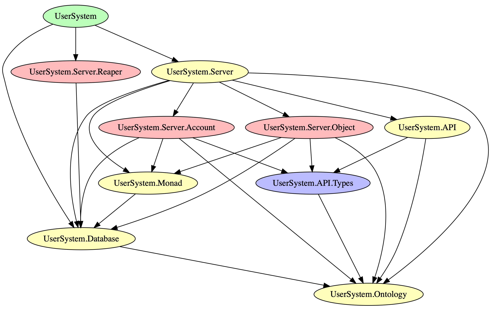

# User System

A basic user system with objects and roles at the user and session level, with 
sessions stored in the database and passwords hashed with bcrypt. Useful for branching off of for 
other projects, kept tearing it out of old ones so I figured I'd give it a home.
To build this, I have used the servant web framework and postgresql-simple. This
allows me to very rapidly integrate raw SQL queries and Haskell in a way
that lets me experiment very quickly.

## Testing

To test the server, you can use the static file server and the various pages located
in the `static` directory. My usual workflow is running something like

```bash
stack run drop; stack run migrate; stack run user-system
```

then I go to `localhost:8080/signup.html`, `localhost:8080/signin.html`, and then test
whatever endpoints I want in whatever sequence is required to test the behavior I want.
It would be nice to design these pages in a way that doesn't require this but, at the moment,
you will be directed to the JSON response instead of to another useful page and you will
have to input the next URL to take your next action. I could make this easier by implementing
an html interface as a part of the response of the various endpoints, but this would clutter
the code, the purpose of which isn't to be used but to help me learn.

## Module Structure


