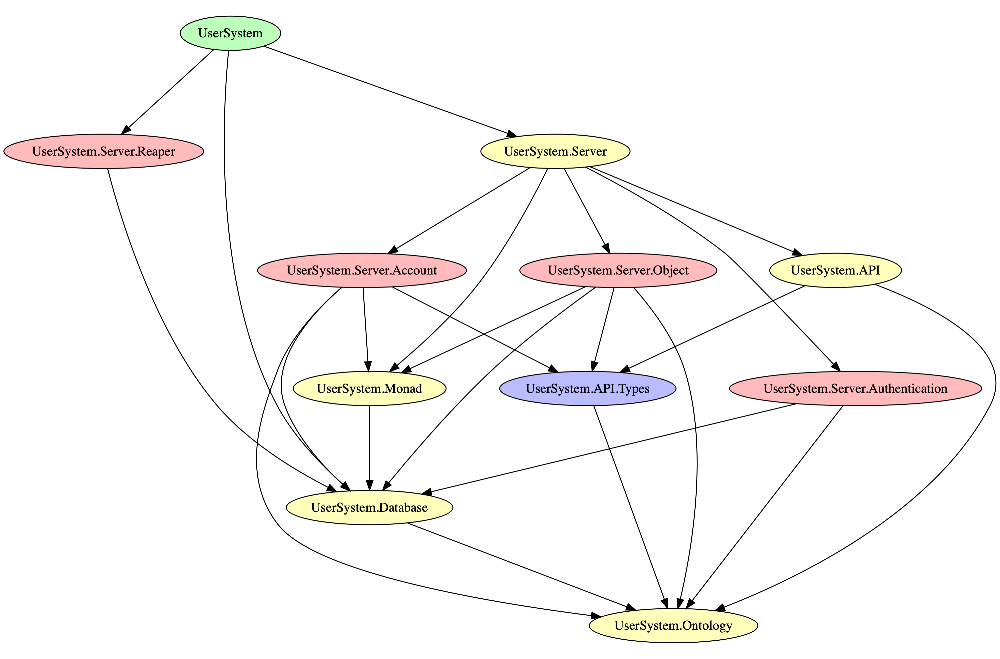

# User System

A basic user system with objects and roles at the user and session level, with 
sessions stored in the database hashed with bcrypt. Useful for branching off of for 
other projects, kept tearing it out of old ones so I figured I'd give it a home.

## Technical Discussion

For the system, I use the servant web framework and postgresql-simple. This
allows me to very rapidly integrate raw SQL queries and Haskell in a way
that lets me experiment very quickly.

Here is the API for the service, which will be self explanatory if you
are familiar with servant. The `Raw` but is for a static file server
which I am using for testing the endpoints using the `FormUrlEncoded`
`ContentType` in servant.

```haskell
type UserSystemAPI
     = "account" :> AccountAPI 
  :<|> Raw

type SimplePost req res = ReqBody '[JSON, FormUrlEncoded] req :> Post '[JSON] res

type SimplePostWithHeaders res = Post '[JSON] (WithCookieHeaders res)

type AccountAPI
     = "signup" :> SimplePost SignUp (Response SignUp)
  :<|> "signin" :> SimplePost SignIn (WithCookieHeaders (Response SignIn)) 
  :<|> AuthenticatedAccountAPI
  
type AuthenticatedAccountAPI
    = AuthProtect "user" :> 
     ( "new-token" :> SimplePostWithHeaders (Response SignIn)
 :<|> "change-password" :> SimplePost ChangePassword (Response ChangePassword)
 :<|> "change-username" :> SimplePost ChangeUsername (Response ChangeUsername)
 :<|> "create-object" :> SimplePost CreateObject (Response CreateObject)
 :<|> "edit-object" :> SimplePost EditObject (Response EditObject)
 :<|> "read-object" :> SimplePost ReadObject (Response ReadObject)
     )

type instance AuthServerData (AuthProtect "user") = User
```

The implementations of these endpoints are mostly quite simple, but I encourage you to read them!
Going in order down this page will make a lot of sense, because that is how I wrote them and how 
the code increased in complexity.

## Module Structure



## POST /account/change-password

### Authentication

A simple HTTP-only session based authentication system


Clients must supply the following data
A session cookie


### Request:

- Supported content types are:

    - `application/json;charset=utf-8`
    - `application/json`
    - `application/x-www-form-urlencoded`

- Samuel Schlesinger (`application/json;charset=utf-8`, `application/json`):

```javascript
{"changePasswordNewPassword":"new-password"}
```

- Samuel Schlesinger (`application/x-www-form-urlencoded`):

```
changePasswordNewPassword=new-password
```

### Response:

- Status code 200
- Headers: []

- Supported content types are:

    - `application/json;charset=utf-8`
    - `application/json`

- No response body

## POST /account/change-username

### Authentication

A simple HTTP-only session based authentication system


Clients must supply the following data
A session cookie


### Request:

- Supported content types are:

    - `application/json;charset=utf-8`
    - `application/json`
    - `application/x-www-form-urlencoded`

- Samuel Schlesinger (`application/json;charset=utf-8`, `application/json`):

```javascript
{"changeUsernameNewUsername":"new-username"}
```

- Samuel Schlesinger (`application/x-www-form-urlencoded`):

```
changeUsernameNewUsername=new-username
```

### Response:

- Status code 200
- Headers: []

- Supported content types are:

    - `application/json;charset=utf-8`
    - `application/json`

- No response body

## POST /account/create-object

### Authentication

A simple HTTP-only session based authentication system


Clients must supply the following data
A session cookie


### Request:

- Supported content types are:

    - `application/json;charset=utf-8`
    - `application/json`
    - `application/x-www-form-urlencoded`

- Samuel Schlesinger (`application/json;charset=utf-8`, `application/json`):

```javascript
{"createObjectContents":"great new object","createObjectName":"object name"}
```

- Samuel Schlesinger (`application/x-www-form-urlencoded`):

```
createObjectContents=great%20new%20object&createObjectName=object%20name
```

### Response:

- Status code 200
- Headers: []

- Supported content types are:

    - `application/json;charset=utf-8`
    - `application/json`

- No response body

## POST /account/edit-object

### Authentication

A simple HTTP-only session based authentication system


Clients must supply the following data
A session cookie


### Request:

- Supported content types are:

    - `application/json;charset=utf-8`
    - `application/json`
    - `application/x-www-form-urlencoded`

### Response:

- Status code 200
- Headers: []

- Supported content types are:

    - `application/json;charset=utf-8`
    - `application/json`

- No response body

## POST /account/new-token

### Authentication

A simple HTTP-only session based authentication system


Clients must supply the following data
A session cookie


### Response:

- Status code 200
- Headers: [("Set-Cookie","<no header sample provided>"),("Access-Control-Allow-Origin",""),("Access-Control-Allow-Headers",""),("Access-Control-Allow-Credentials","false")]

- Supported content types are:

    - `application/json;charset=utf-8`
    - `application/json`

- No response body

## POST /account/read-object

### Authentication

A simple HTTP-only session based authentication system


Clients must supply the following data
A session cookie


### Request:

- Supported content types are:

    - `application/json;charset=utf-8`
    - `application/json`
    - `application/x-www-form-urlencoded`

### Response:

- Status code 200
- Headers: []

- Supported content types are:

    - `application/json;charset=utf-8`
    - `application/json`

- No response body

## POST /account/signin

### Request:

- Supported content types are:

    - `application/json;charset=utf-8`
    - `application/json`
    - `application/x-www-form-urlencoded`

- Samuel Schlesinger (`application/json;charset=utf-8`, `application/json`):

```javascript
{"signInUsername":"samuel","signInPassword":"password"}
```

- Samuel Schlesinger (`application/x-www-form-urlencoded`):

```
signInUsername=samuel&signInPassword=password
```

### Response:

- Status code 200
- Headers: [("Set-Cookie","<no header sample provided>"),("Access-Control-Allow-Origin",""),("Access-Control-Allow-Headers",""),("Access-Control-Allow-Credentials","false")]

- Supported content types are:

    - `application/json;charset=utf-8`
    - `application/json`

- No response body

## POST /account/signup

### Request:

- Supported content types are:

    - `application/json;charset=utf-8`
    - `application/json`
    - `application/x-www-form-urlencoded`

- Samuel Schlesinger (`application/json;charset=utf-8`, `application/json`):

```javascript
{"signUpUsername":"samuel","signUpPassword":"password"}
```

- Samuel Schlesinger (`application/x-www-form-urlencoded`):

```
signUpUsername=samuel&signUpPassword=password
```

### Response:

- Status code 200
- Headers: []

- Supported content types are:

    - `application/json;charset=utf-8`
    - `application/json`

- No response body


